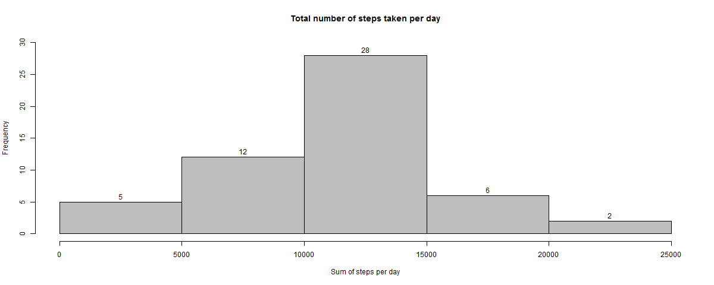
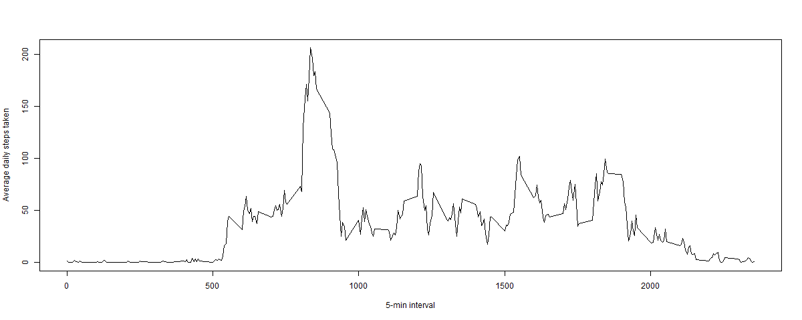
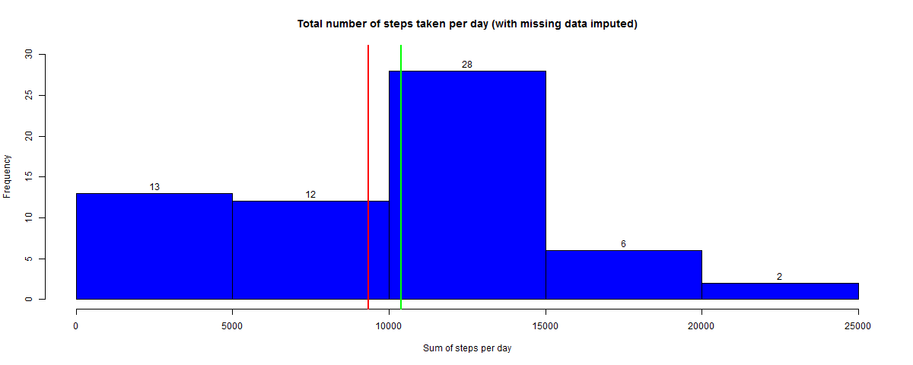
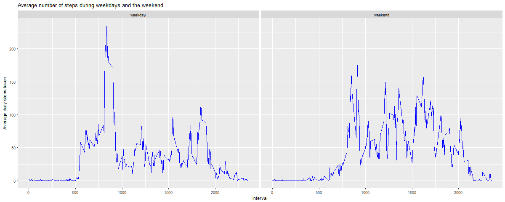

# Reproductible research : Programming Assignment 1

## Loading and preprocessing the data

First of all, we will create a new folder, in the current working directory :

```{r folder, echo = TRUE, warning = FALSE}
dir.create("./Reproductible research_PA1")
```
In it we will dowload and unzip the data set :

```{r dowload, echo = TRUE}
setwd("./Reproductible research_PA1")
url <- "https://d396qusza40orc.cloudfront.net/repdata%2Fdata%2Factivity.zip"
download.file(url, destfile = "dowloaded_dataset.zip", mode ="wb")
unzip("dowloaded_dataset.zip")
```

Then we can read the csv file with the following code :
```{r csv, echo =TRUE}
data <- read.csv("./Reproductible research_PA1/activity.csv", 
                 stringsAsFactors = FALSE)
```

The dataset is ready to use 

## What is mean total number of steps taken per day?

For this part of the assignment, we will ignore the missing values in the dataset.
```{r remove_NA, echo = TRUE}
data0NA <- na.omit(data)
```

### 1. Calculate the total number of steps taken per day

We will use `dplyr` package to transform the original dataset, to have the
sum of steps per day :

```{r dplyr, echo = TRUE, message = FALSE, warning = FALSE}
library(dplyr)
```

```{r transformation, echo = TRUE}
ndata <- data0NA %>%
        mutate(date = as.Date(date)) %>%
        group_by(date) %>%
        summarise(sum_steps = sum(steps))
```

### 2. Make a histogram of the total number of steps taken each day

We will use R basic plotting system to create our histogram

```{r 1st_plot}
hist(ndata$sum_steps,
     xlab = "Sum of steps per day",
     ylab = "Frequency",
     main = "Total number of steps taken per day",
     col = "gray",
     ylim = c(0, 30),
     labels = TRUE)
```


### 3 . Calculate and report the mean and median of the total number of steps taken per day

We will calculate the mean of the total steps per day...
```{r mean, echo = TRUE}
mean(ndata$sum_steps)
```

...and the median
```{r median, echo = TRUE}
median(ndata$sum_steps)
```

## What is the average daily activity pattern?

### 1. Make a time series plot of the 5-minute interval and the average number of steps taken, averaged across all days

First, we transform the original dataset, to have the average steps per interval

```{r transformation_2, echo = TRUE}
ndata2 <- data0NA %>%
        group_by(interval) %>%
        summarise(mean_steps = mean(steps))
```

Then we plot the data to obtain a time serie for average steps per interval
```{r 2nd_plot, echo = TRUE}
with(ndata2, plot(mean_steps ~interval,
                 type = "l",
                 col = "black",
                 xlab = "5-min interval",
                 ylab ="Average daily steps taken"))

```


### 2. Which 5-minute interval, on average across all the days in the dataset, contains the maximum number of steps?


```{r max2, echo = TRUE}
filter(ndata2, mean_steps == max(mean_steps))
```
According the above code, the maximum of the average steps per days is obtain after 835 minutes, means almost 14 hours

# Imputing missing values

### 1. Calculate and report the total number of missing values in the dataset

We back to the original dataset, called `data`

First off all we will show how many row contains and in which column we have NA value.

We see that our dataset without NA,`data0NA`, contains 15 264 rows whereas our original dataset contains 17 568 rows.
Subracting those figures, we can deduct that there is 2 304 rows which contain NA value.

But let's check that point : 

```{r NA_count, echo = TRUE}
sum(!complete.cases(data))
```

As we suppose, there well are 2 304 rows wich are not complete case, so which contains NA value.

Now, we will see where the NA value are.

```{r NA_count2, echo = TRUE}
apply(data, 2, function(x){sum(is.na(x))})
```

So, all of the NA value is in `steps` column. To sum up we can construct the following table
```{r NA_count3, echo = TRUE}
table(is.na(data$steps))
```

### 2. Devise a strategy for filling in all of the missing values in the dataset and create a new data set

We suppose that if there is NA value, is because there is no steps to be recorded, in other word NA value should be equal to 0.

So we will reasign NA value to 0.

To do that we will create a new data `clean_data` set wich is the the combination of two subset of the original dataframe `data`:

* `dataNA` = the subset of the original data frame which only contains NA value and for which we set 0 to all NA value

* `data0NA`= the subset of the original data frame which doesn't contains any NA value

The following script show how we proceed

```{r set_NA_to_0, echo =  TRUE}
dataNA <- data[is.na(data),]
dataNA[is.na(dataNA)] <-0
clean_data <- rbind(data0NA,dataNA)
clean_data <- clean_data[order(clean_data$date),]
head(clean_data)
str(clean_data)
```

### 3. Make an Histogram of the total number of steps taken each day

As for the other histogram, we will start modifying the dataset and then we will plot the data (showing on it where the mean and median are)

```{r transformation3-plot, echo = TRUE}
ndata3 <- clean_data %>%
        mutate(date = as.Date(date)) %>%
        group_by(date) %>%
        summarise(sum_steps = sum(steps))

hist(ndata3$sum_steps,
     xlab = "Sum of steps per day",
     ylab = "Frequency",
     main = "Total number of steps taken per day (with missing data imputed)",
     col = "blue",
     ylim = c(0, 30),
     labels = TRUE)

abline(v=mean(ndata3$sum_steps),
       col = "red",
       lwd = 2)

abline(v=median(ndata3$sum_steps),
       col = "green",
       lwd = 2)

```


```{r computetime, echo = FALSE}
mn <- round(mean(ndata3$sum_steps), 1)
med <- median(ndata3$sum_steps) 
options(scipen=999)
```

So the mean for the new data set is about `r mn` and the new median is `r med`

Comparing, the previous histogram the data is quite similar. However, the mean is less than before because we increase the number of 0 in the original dataset (so the mean of the total number of steps per day decrease).

For the same reason the frequency of steps taken per day between 0 and 5 000 increases (5 in the previous dataset against 13 for the new one). Indeed, the number of row where the steps are set to 0 grows (+ 2 304 new entries).

For the rest the data don't move and the frequency by number of steps remians the same in the two graphics.

What's more, the median almost remain the same (10 935 for new data set against 10 765 in the former one)

## Are there differences in activity patterns between weekdays and weekends?

### 1. Create a new factor variable in the dataset with two levels - "weekday" and "weekend" indicating whether a given date is a weekday or weekend day

Frist of all we will transform our data frame to have 

```{r modif, echo = TRUE}
ndata4 <- data0NA %>%
        mutate(date = as.Date(date)) %>%
        mutate(day = ifelse(weekdays(date) %in% c("samedi","dimanche") , "weekend", "weekday")) %>%
        group_by(interval, day) %>%
        summarise(mean_steps = mean(steps))
```

### 2. Make a panel plot containing a time series plot of the 5-minute interval and the average number of steps taken, averaged across all weekday days or weekend days

To plot the new dataset we will use `ggplot`package

```{r ggplot, echo = TRUE, message= FALSE, warning= FALSE}
library(ggplot2)
```

```{r final_plot, echo = TRUE}
g <- qplot(interval, mean_steps, data = ndata4, geom ="line")

g + geom_line(colour = "blue") + facet_grid(.~day) + 
        ggtitle("Average number of steps during weekdays and the weekend ")+
        ylab("Average daily steps taken") 

```

        

